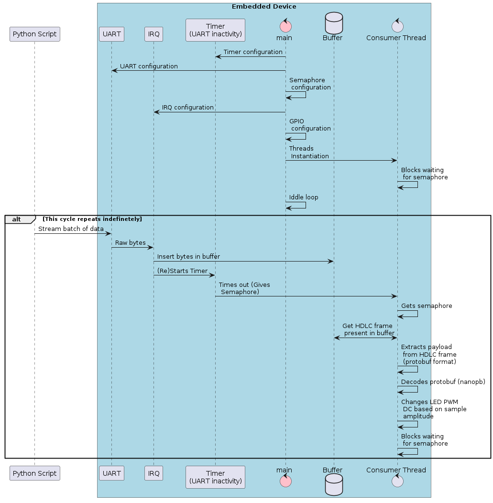

# Zephyr producer consumer with threads

- This is a Zephyr workspace application.
- This app implements the producer / consumer concept.
- This project was developed using `STM32F407 Discovery` development kit but it should be able to run in other targets, since there are only common features being used like LED, GPIO, PWM, timer, Serial (UART).

## The overall structure of the project is:
- Python script running on the host machine produces, serializes and sends data to embedded device over UART (1152008N1)
- Embedded device receives, deserializes and processes the data in order to produce a corresponding output



- The python script in `scripts/stream_sin_wave.py` is responsible for producing the serialized data
    - In this example, the data being produced corresponds to a stream of samples of a sinusoidal wave
    - [Read more about the sinusoidal wave tunning here](scripts/readme.md)
    - The samples can be generated as json, protobuf or HDLC frames and it can be streamed either to a file, stdout or to a serial port

- The source code under `src` presents the embedded software of the system
    - Bytes are received in an UART ISR and injected into a buffer
    - Upon UART inactivity, a thread processes the bytes, unwrapping the HDLC frame, decoding the protobuf payload and changing a PWM duty cycle according to the samples amplitude.


# How to operate the repository
## Cloning and initializing
- This repository can be cloned and initialized in one of two ways:
    - Within the system's default zephyr workspace (zephyr as the manifest repository for `west`)
    ```bash
    cd ~/zephyrproject
    git clone git@github.com:TSMotter/zpc.git
    cd zephyr
    west config manifest.project-filter +nanopb && west update`
    ```
    - In a custom zephyr workspace for itself (zpc as the manifest repository for `west`)
    ```bash
    west init -m git@github.com:TSMotter/zpc.git --mr master zpc_workspace
    cd zpc_workspace
    west update
    ```

## Building, flashing and running
- Remember to have the zephyr virtual environment active on the current shell
```bash
source ~/zephyrproject/.venv/bin/activate
```

- To format the code base with clang-format:
```bash
./bbuild.sh -f
```

- To build:
```bash
./bbuild.sh -b
```

- To rebuild:
```bash
./bbuild.sh -r
```

- To flash the built binary onto the board:
```bash
./bbuild.sh -l
```

- To format, build and flash:
```bash
./bbuild.sh -f -b -l
```

- To check all options available:
```bash
./bbuild.sh --help
```

- To debug protobuf encapsulation:
```bash
$ python scripts/stream_sin_wave.py -op PROTOBUF_TO_FILE -c channel_20_200_2
# file "batch.bin" will be created...
$ protoc --decode Batch proto/sin_wave.proto < batch.bin 
```

- Once the embedded device is running with the application code and the TTL/USB device is connected between it and host machine, it is time to use the python script to stream sinusoidal wave samples to the target
    - When the device starts receiving and processing the wave samples, it'll be possible to see the diming orange LED where the intensity of the LED light is correspondent to the sinwave's current amplitude.
```bash
python scripts/stream_sin_wave.py --loglevel DEBUG --operation HDLC_TO_SERIAL --channel channel_20_20_1 --device /dev/ttyUSB0
```

## This project uses:
- **zephyr rtos** is used as platform
    - When using latest versions of zephyr it might be necessary to do the following:
        - `(.venv) ggm@gAN515-52:~/zephyrproject/zephyr ((HEAD detached at v3.5.0))$ west config manifest.project-filter +nanopb && west update`
```bash
ggm@gAN515-52:~/zephyrproject/zephyr ((HEAD detached at v3.5.0))$ git log -n1 --oneline --decorate
a6eef0ba37 (HEAD, tag: zephyr-v3.5.0, tag: v3.5.0) release: Zephyr 3.5.0 release
```

- **protobuf-compiler** is necessary to transform `.proto` files into source code
```bash
$ sudo apt install protobuf-compiler
$ protoc --version
libprotoc 3.12.4
```

- **clang-format** is used as formatter/code beautifier
```bash
$ clang-format --version
clang-format version 17.0.2 (https://github.com/ssciwr/clang-format-wheel f928550dfaa8e13ccf1b9f7f76356f461d08c707)
```

- **yahdlc** is used as HDLC protocol library in C/C++.
    - Link: [yahdlc - Yet Another HDLC](https://github.com/bang-olufsen/yahdlc/tree/master)
    - The revision being used here is tag `v1.1` hash `752602a`
- Python dependencies are listed in `scripts/requirements.txt` with the specific versions used